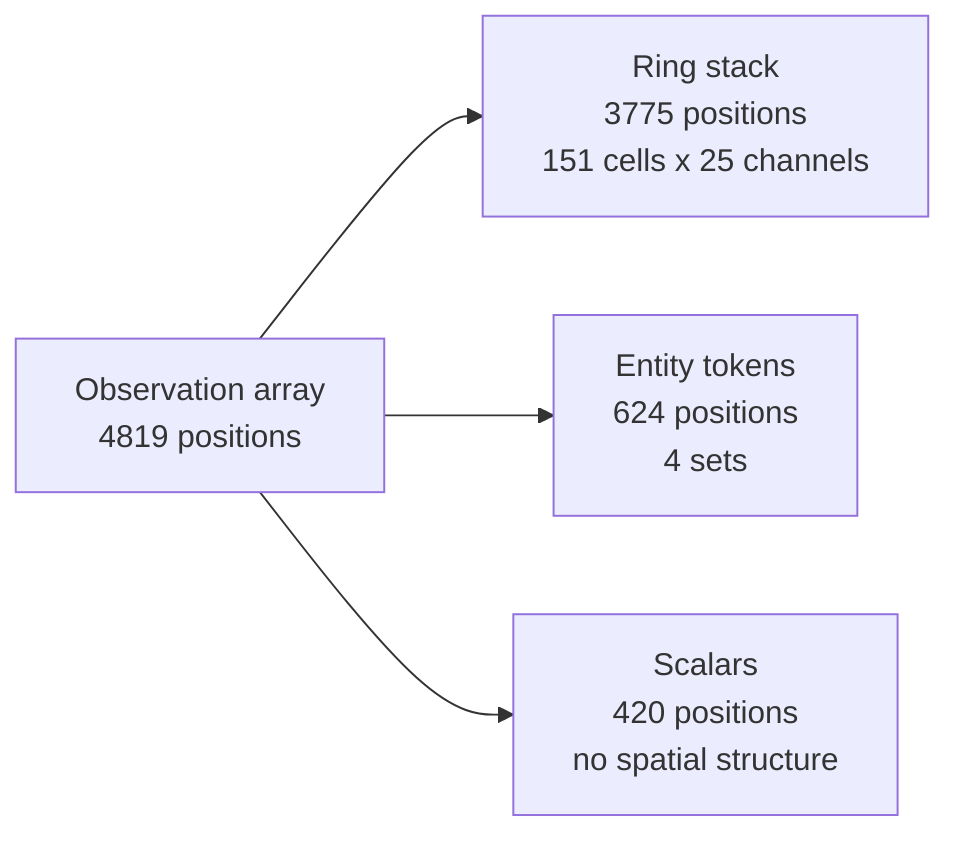
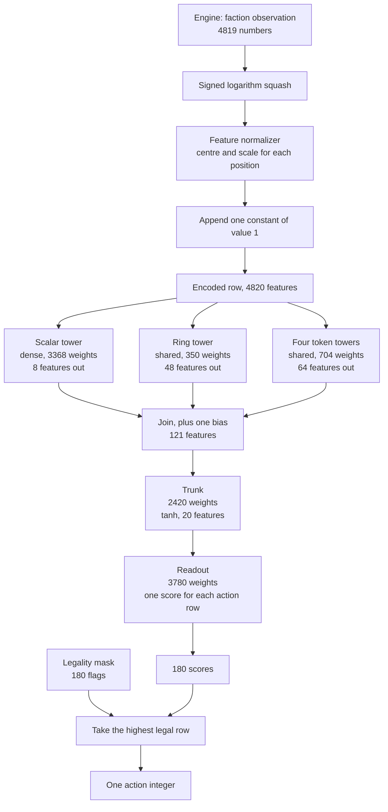
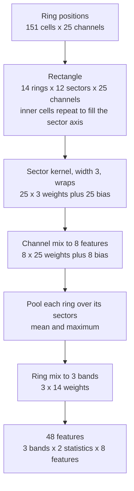
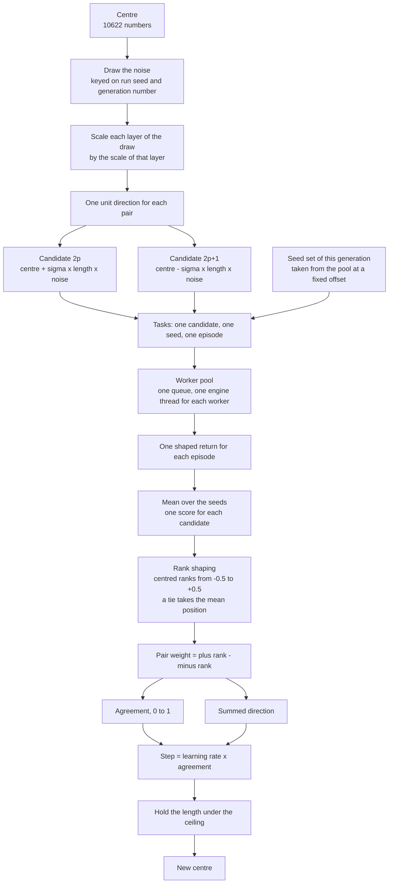
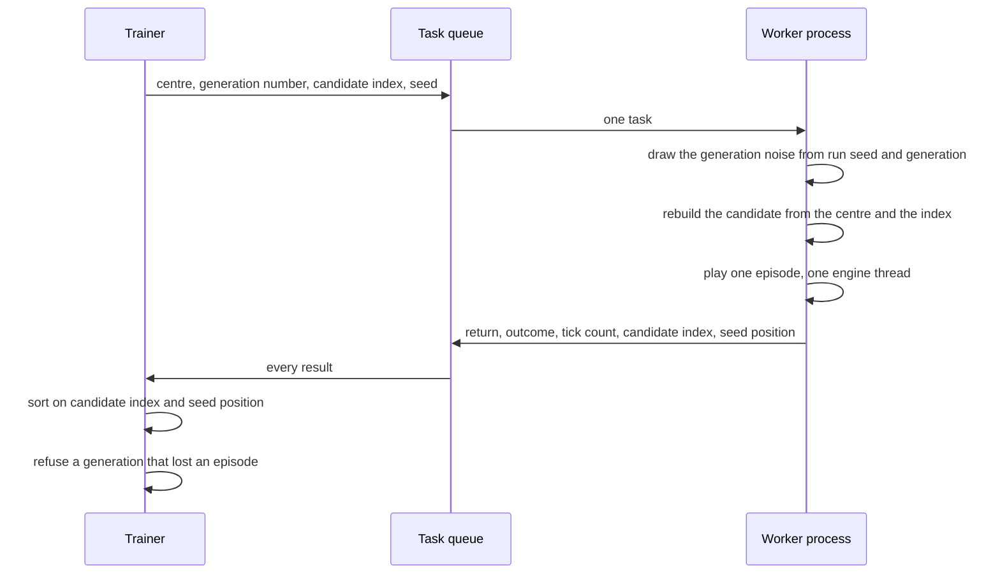
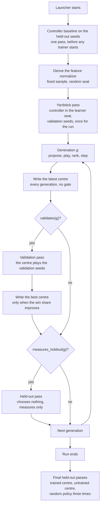

# What the Policy Reads, and How a Generation Trains

This document describes the reinforcement learning architecture of this
project, and the training method that moves it. A reader who knows nothing
about the project can read it alone.

Cachette is a deterministic world simulation engine. The core is Rust. The
control plane is Python. The engine simulates a hex world. A faction is one
player of that world. The learner takes one faction seat and plays against
built-in controllers.

The document answers three questions. What does the policy read? What does the
policy produce? What happens in one generation of training?

**Every figure below comes from one probe script.** The script reads the
schema that the engine publishes and the default widths that the policy
declares. It prints the counts, and this document quotes them.[^1] A figure
here is a count of positions or of weights. It is not a measurement of a
machine, so it holds on any machine and at any thread count.[^2]

The figures are current for the observation schema at version 7 and the action
schema at version 2. Run the probe again after a schema change.

---

## 1. The world one episode plays

One episode is one world. A reset builds a new world, and it never reuses the
world of the last episode.[^3]

| Property | Value |
|---|---|
| Extent | 128 columns by 128 rows |
| Factions | 3 |
| Learner seat | 0 |
| Tick limit | 6000 |
| Decision interval | 10 ticks |
| Horizon | 600 decisions |

The trainer declares these five values in one place, and it derives the
horizon from the tick limit and the interval.[^4]

The tick limit is a rule of the game and not a cut. The engine compares held
ground at the limit and records a winner. Every episode therefore ends won,
lost or drawn.

The learner acts once every 10 ticks. The engine runs the other 9 ticks with
no learner input. A learner that acted on every tick would spend its sample
budget on ticks that changed almost nothing.

The learner sees only what a player of its faction sees. The environment calls
the readers that answer for one faction, and it calls no reader that answers
from the truth of the whole world.[^5]

---

## 2. What the engine publishes

The engine publishes one flat array of 4819 numbers for the seated faction.
The array holds three kinds of part, and each kind has a different shape.

**The ring stack is an egocentric picture.** It holds 14 rings at growing hex
distance from the centroid of the faction, and 12 sectors of direction. Ring 0
holds one cell and has no direction. Ring 1 holds six cells. Every wider ring
holds twelve. That gives 151 cells, and each cell carries 25 channels.

The axes of the ring frame do not turn between decisions.[^6] A sector
therefore names the same direction at every decision of an episode.

**An entity token set is a set.** A token position names no seat and carries
no identity, so two orders of the same tokens mean one input.[^7] The engine
publishes four sets.

| Token set | Tokens | Channels | Positions |
|---|---|---|---|
| `token_own_settlements` | 8 | 24 | 192 |
| `token_rivals` | 6 | 24 | 144 |
| `token_threat_clusters` | 8 | 20 | 160 |
| `token_candidate_sites` | 8 | 16 | 128 |

An absent token reads zero in every channel, including its validity channel.

**Every other position is a scalar.** The 420 scalar positions carry counts,
shares, rates of change, victory track progress, memory of past readings and
the weights of the current objective. They hold no spatial structure, so no
weight can be shared across them.

The three parts cover the array and never overlap. The layout module derives
the scalar positions rather than stating them, so a field that the engine adds
joins the scalar part rather than going unread.[^8]

---

## 3. What the policy produces

The policy produces one integer. The integer names one row of a fixed action
table of 180 rows.[^9]

| Verb | Rows | Argument the row carries |
|---|---|---|
| `no_op` | 1 | none |
| `gather` | 3 | a resource kind |
| `build` | 7 | an upgrade category |
| `relation` | 3 | another faction |
| `campaign` | 152 | a place |
| `advertise` | 1 | none |
| `trade` | 1 | none |
| `carry` | 1 | none |
| `project` | 1 | none |
| `queue` | 8 | a unit type |
| `cross` | 1 | none |
| `settle` | 1 | none |

The campaign verb holds 152 rows because it names a place. The first place
value names the whole frame. The other 151 values name one cell of the same
egocentric frame that the ring stack publishes.[^10] The frame therefore
serves the reading side and the acting side.

The engine resolves what each verb does. The learner never loops over
units.[^11]

The engine also publishes a legality mask over the 180 rows. The policy scores
every row and then takes the highest-scoring legal row.[^12]

---

## 4. The policy

The policy is a small network with three towers, one trunk and one
readout.[^13]

### 4.1 The path from an array to an action

The squash takes the signed logarithm of every position and divides by a fixed
scale. The normalizer then subtracts a centre and divides by a scale, one pair
for each position. A run derives the normalizer once, before the first
generation, from a fixed sample of episodes that a random seat plays. Every
candidate of every generation reads that one normalizer. Two candidates that
read two feature transforms are not comparable.[^14]

The bias entry of value 1 is never centred and never scaled.

### 4.2 The ring tower

The ring tower is the reason the policy can read 3775 positions for 350
weights.

**The sector axis wraps, so one kernel serves every direction.** The policy
states a rule such as "push toward the sector that holds the most unclaimed
land" one time, and not one time for each direction. A rotation of the world by
one hex direction rolls the feature map along the sector axis and changes
nothing else.

**The ring axis does not wrap, and no kernel runs along it.** Each ring covers
a different amount of ground, so the tower never shares a weight between two
rings. One learned matrix mixes the 14 rings into 3 bands, so the policy
chooses its own notion of near and far.

The stack is not rectangular. Ring 0 holds one cell and ring 1 holds six. The
tower repeats those inner cells to fill the sector axis. The repetition costs
no weight and keeps a rotation a shift on the sector axis in every ring.

The pool over sectors makes the tower output invariant to a rotation. No row of
the action table names a hex direction, so the readout loses nothing to the
pool.

### 4.3 The token towers

One encoder runs over every token of a set. A mean and a maximum then pool the
results over the tokens. The output does not depend on the order of the tokens,
which is what the record requires of a reader.[^7]

Each set costs one encoder rather than one weight for each slot. The encoder
reads the validity channel, so it can answer a constant for an absent token.

### 4.4 The scalar tower

The scalar tower is one dense layer over the 420 scalar positions and the bias
position. It is the one place where the policy pays position by position. It
holds 3368 weights, which is the largest single term of the three towers.

Every layer is trainable. An earlier design held the scalar layer at a fixed
draw. A change to those weights then reached no score, whatever the trainer
did.

### 4.5 The start of a run

The readout starts at zero. Every earlier layer starts at a draw from one fixed
seed. A zero readout scores every action row at zero. The choice then falls to
the lowest legal row, which is the no-op, so an untrained policy measures a
faction that does nothing. That policy is one of the three baselines a run
reports.[^4]

A layer of zeros behind another layer of zeros gives no change under any
perturbation, so only the readout may start at zero.

### 4.6 The trainable count

| Part | Weights | How the count follows |
|---|---|---|
| Scalar tower | 3368 | 8 x (420 + 1) |
| Ring tower | 350 | 25x3 + 25 + 8x25 + 8 + 3x14 |
| Token towers | 704 | 8 x (24+1 + 24+1 + 20+1 + 16+1) |
| Trunk | 2420 | 20 x (120 + 1) |
| Readout | 3780 | 180 x (20 + 1) |
| **Total** | **10622** | |

A dense layer that read every observation position for every action row would
hold 867420 weights. The structured policy holds 1.2 percent of that. A test
asserts that the total stays under the dense product.[^13]

---

## 5. Why the weight count governs the design

The optimiser is an evolution strategy. It has no gradient. It estimates a
direction by sampling directions and ranking what they score.

One measurement gives the law that governs every width above. **The cosine
between the step of one generation and the true direction of steepest ascent
is near the square root of the pair count divided by the trainable count.** The
same measurement found that the noise of scoring on one world halves that
cosine.[^15]

The search states the law and derives a second number from it. Each step turns
the centre by one angle. The part of the turn that points at the truth
accumulates with the generation count. The part that does not point at the
truth accumulates as a random walk, so it grows with the square root of the
generation count. The two are equal after one over the square of the cosine
generations.[^16]

The probe prints both numbers at the current trainable count of 10622.[^1]

| Population | Pairs | Cosine | Generations before a climb passes a wander |
|---|---|---|---|
| 16 | 8 | 0.0274 | 1328 |
| 24 | 12 | 0.0336 | 886 |
| 64 | 32 | 0.0549 | 332 |
| 256 | 128 | 0.1098 | 83 |

Two consequences follow. A wider population costs episodes and buys alignment,
and a doubled cosine needs four times the population. A wider policy costs
alignment at a fixed population, so a caller who wants a better aligned step
lowers the scalar width first.

The generation column is optimistic by a factor of four, because scoring noise
halves the cosine and the derivation takes the cosine it is given.[^16]

---

## 6. One training generation

A run holds a centre. The centre is one flat vector of 10622 numbers. One
generation perturbs the centre, plays the perturbations, ranks what they
scored, and steps the centre.

### 6.1 The draw

**The noise of a generation is a function of the generation.** The generator
reads the run seed and the generation number, and never a stream that a
generation advances. A resumed run therefore draws the perturbations that the
run it continues drew. A worker process draws the same numbers from the same
two inputs.[^17]

Each row of the draw is one direction of unit length. The draw is isotropic,
and the search then scales each layer of it by the scale of that layer. The
layers of this policy span a factor of seven in scale, and an unweighted draw
would rewrite the small layers and barely turn the large ones.[^18]

### 6.2 The antithetic pair

The search tries each perturbation in both signs. Candidate `2p` is the plus
half and candidate `2p+1` is the minus half. A population of 24 therefore holds
12 pairs. This is antithetic sampling, and it means the estimate of the
direction costs no extra variance from the mean of the population.

Sigma is a fraction of the centre and never a length. The default is 0.5.
A measurement varied sigma over four settings against one trained centre. The
value 0.5 gave the largest signal, the best ratio of signal to noise, and the
highest rank agreement between two disjoint world sets.[^19]

The same measurement gives the number of worlds that one candidate needs at
each sigma, so that the spread between candidates exceeds the noise on one
score. The trainer prints a warning on the first line of a run that gives
fewer worlds than its sigma needs.[^20]

### 6.3 The score

Every candidate of one generation plays the same seed set. The score of a
candidate is the mean shaped return over those seeds.[^21]

The seed set moves at the next generation, so a policy cannot learn one map.
**The mean of a generation is therefore not a learning curve.** A mean that
rises may only mean that the new worlds are easier. Only the held-out
measurement is evidence.[^22]

The shaped return is the training signal. The control plane computes it, and
the engine holds no reward. The reward reads the observation array of the
faction and one public fact, which is the winner of a game that has already
ended.[^23]

### 6.4 The rank, the agreement and the step

Rank shaping replaces each score by its centred rank, from minus a half to plus
a half. A tied set of scores takes the mean of the positions it occupies. The
tie rule matters. A stable sort would order tied candidates by candidate index,
and the candidate index is a number the search chose when it drew the
perturbations.[^24]

The agreement is a statistic of the ranks alone. It is one when the two halves
of every pair sit at opposite ends of the ranking. It is zero when the pair
weights reach only what a ranking of pure noise reaches. Both bounds follow
from the population size and from nothing that a generation scored.[^25]

The search multiplies the learning rate by the agreement. The learning rate
therefore becomes a bound. It is the largest fraction of the centre that one
generation may move, and a generation reaches it only by splitting every pair
to the ends of the ranking. The default learning rate is 0.3.[^26]

A generation whose candidates all scored the same number reports that it
carried no information, and the centre does not move.

### 6.5 The bound on the length

A positive scaling of these weights moves the choice, because every tower ends
in a saturating function and because a bias does not scale with the weights
beside it. The search therefore never normalises this centre.

The length of the centre instead rises over a run, and a rising length
saturates the layers. The search holds the length under twice the length of the
untrained shell. One audit measured a run of twenty generations at a learning
rate of 0.3 and found the length grew by 2.37.[^27]

---

## 7. How a generation reaches the machine

**One task is one strategy, one candidate and one seed.** A generation of 24
candidates over 6 seeds is 144 tasks.[^28]

**A worker rebuilds its candidate and never receives it.** The perturbation is
a function of the run seed, the generation number and the pair index, so a
worker that holds the centre builds exactly the candidate that the trainer
would build. It sends back a few numbers.

**Nothing reads which worker answered first.** Each result names the candidate
index it started at and the seed position it played, and the combination sorts
on that key. An episode is a pure function of the policy and the seed, so
completion order cannot reach a score.[^29]

The combination also checks that the results cover every candidate on every
seed exactly once. A generation that lost an episode fails rather than training
on a subset.

Each worker holds the engine to one thread. More engine threads for one world
step is slower at every extent this project trains on.[^28] The pool sets the
matrix library thread variables before it starts a process, so a worker does
not start one matrix thread for each core.

---

## 8. The schedules

Several passes run beside the generations. Each one has its own schedule.

**One module declares both schedules, and two callers read them.** The training
loop plays a pass, and the sizing module counts what a run will play. Two
copies of one interval would leave a plan that counted a schedule the run does
not run, and nothing would fail.[^30]

The validation rule is this. A generation validates when its index modulo the
interval equals the interval minus one. The last generation always validates,
because a run that ended between two intervals would publish a centre that
nothing selected. An interval of zero or less leaves only the last
generation.[^30]

The held-out rule is simpler. A generation measures when its index modulo the
interval equals the interval minus one. An interval of zero or less turns the
periodic pass off.[^30]

### 8.1 The two centres are two files

**The latest centre is the resume point.** The run writes it after every
generation, with no validation gate and no improvement gate. A run that a wall
clock cap stops between two validation passes must still leave a resume point
behind.

**The best centre is what a reader loads to play or to measure.** It moves only
when a validation pass finds something better. The run selects on the win share
of that pass and breaks a tie on the mean shaped return.[^31]

Conflating the two files cost this project twice. Writing only the best meant
that a run with no validation seeds wrote nothing until it ended. Writing only
the latest meant that one run stored a centre taken from inside a collapsed
region.[^22]

A resumed run continues the run. It reads the centre, the generation counter
and the best score, so it neither repeats generations already paid for nor
overwrites a better checkpoint with a worse one. It refuses a checkpoint from
another world, and it refuses one written under another feature
normalizer.[^32]

### 8.2 Which seeds answer which question

| Seed set | Chooses the centre | What it says |
|---|---|---|
| Training seeds | no | the ranking of one generation |
| Validation seeds | yes | a maximum over the passes of the run |
| Held-out seeds | no | the honest figure |

A validation figure is a selection maximum and never an unbiased measurement.
The held-out seeds choose nothing, so a held-out figure is the number to
report.[^31]

The held-out pass runs at an interval rather than only at the end. A run under
a wall clock cap can stop at any generation, and a pass that ran only after the
loop returned left no honest figure behind at all.[^22]

### 8.3 The three baselines

A run reports its centre against three baselines.[^4]

- **The untrained policy.** Its readout is zero, so it takes the no-op at every
  decision. It measures a faction that does nothing.
- **The random policy.** It takes one legal row at random. It measures a
  faction that acts without reading the world. The engine is deterministic, so
  only this baseline gains from a repeat, and the final passes repeat it three
  times.
- **The controller baseline.** It gives the learner seat back to the built-in
  controller. It measures the opponent the learner trains against.

**The controller baseline is the real measure.** A policy that beats the first
two and loses to the third has learned to act, and not to play.

The launcher plays the controller baseline on the held-out seeds once, before
any trainer starts, and it caches the answer. One set of games answers for
every strategy of the launch, because the games come from the world and the
seed set, and the objective only weights their readings.

Each run also starts a yardstick pass. That pass puts the built-in controller
in the learner seat on the validation seeds. The run reports every validation
score against that number. The controller does not learn, so the pass runs once
for the run. The trainer does not wait for it, because no generation reads it.

### 8.4 What a run plays, at the current defaults

The command line declares its own defaults, and a caller may override any of
them.[^4]

| Argument | Default |
|---|---|
| `--generations` | 20 |
| `--population` | 24 |
| `--seeds` | 6 |
| `--validation` | 6 |
| `--validate-every` | 3 |
| `--holdout` | 256 |
| `--holdout-every` | 5 |
| `--sigma` | 0.5 |
| `--learning-rate` | 0.3 |

The configuration record declares a second set of defaults, for a caller that
builds it directly rather than through the command line.[^33] The two sets
differ. The command line passes every value it parsed, so the command line
values are the ones a run plays.

At the table above, one strategy trains on 20 x 24 x 6 episodes, which is
2880. The measurement passes add the validation passes, the periodic held-out
passes, five final held-out passes and a share of the one controller baseline
pass. The sizing module counts them from the schedules rather than from a
second copy of the intervals.[^30]

---

## 9. What this document does not answer

**It states no cost and no throughput.** Those figures belong to the target
platform, and a register holds them. The development machines have a different
cache line size, so a local measurement misleads.[^34]

**It states no reward weight.** What a faction is rewarded for is a rule of the
downstream game. A register holds one row for each term, and one blocker holds
the rules.[^35]

**It does not say whether the towers learn.** A separate note reports that
measurement.[^36]

---

## References

[^1]: The policy shape probe. `scripts/policy_shape.py`
[^2]: ADR-0001, one binary gives one answer at any thread count. `docs/adrs/accepted/adr-0001-one-binary-gives-one-answer-at-any-thread-count.md`
[^3]: The learner environment. `python/cachette/learn/env.py`
[^4]: The training entry point: the world every strategy plays, the three baselines and the argument defaults. `python/cachette/learn/__main__.py`
[^5]: PRD-0001, a faction sees only what it observes. `docs/product/accepted/prd-0001-a-faction-sees-only-what-it-observes.md`
[^6]: ADR-0195, the observation of a faction is a fixed-width scale-free table, decision D3. `docs/adrs/draft/adr-0195-the-observation-of-a-faction-is-a-fixed-width-scale-free-table.md`
[^7]: ADR-0195, decision D4. `docs/adrs/draft/adr-0195-the-observation-of-a-faction-is-a-fixed-width-scale-free-table.md`
[^8]: The observation layout, read from the schema. `python/cachette/learn/layout.py`
[^9]: ADR-0176, an action integer is a mixed radix over the argument positions each verb declares. `docs/adrs/accepted/adr-0176-an-action-integer-is-a-mixed-radix-over-the-positions-a-verb-declares.md`
[^10]: ADR-0199, a verb names a place by a cell of the egocentric frame the observation publishes, decisions D1 and D2. `docs/adrs/draft/adr-0199-a-verb-names-a-place-by-a-cell-of-the-egocentric-frame.md`
[^11]: ADR-0040, Python is a control plane, not a data plane, decision D1. `docs/adrs/draft/adr-0040-python-is-a-control-plane-not-a-data-plane.md`
[^12]: The policy module, the one declaration of how a mask meets a score. `python/cachette/learn/policy.py`
[^13]: The structured policy. `python/cachette/learn/structured.py`
[^14]: The reference sample of the feature normalizer. `python/cachette/learn/normalize.py`
[^15]: Findings register, FND-668. `docs/FINDINGS.md`
[^16]: The search, the step alignment and the generations before a climb beats a wander. `python/cachette/learn/search.py`
[^17]: ADR-0194, a generation is scored one episode at a time, and combined in candidate order, decision D2. `docs/adrs/draft/adr-0194-a-generation-is-scored-in-shards.md`
[^18]: Findings register, FND-713. `docs/FINDINGS.md`
[^19]: Report on how sigma trades against the worlds each candidate plays, section 7. `docs/research/how-sigma-trades-against-worlds-for-each-candidate.md`
[^20]: Report on how sigma trades against the worlds each candidate plays, sections 4 and 6. `docs/research/how-sigma-trades-against-worlds-for-each-candidate.md`
[^21]: The population play of one generation. `python/cachette/learn/rollout.py`
[^22]: Report on what is wrong with training and evaluation, items 1 and 2. `docs/research/what-is-wrong-with-training-and-evaluation.md`
[^23]: The reward of one faction. `python/cachette/learn/reward.py`
[^24]: Report on how sigma trades against the worlds each candidate plays, section 5. `docs/research/how-sigma-trades-against-worlds-for-each-candidate.md`
[^25]: The search, the agreement of a generation. `python/cachette/learn/search.py`
[^26]: The training configuration record, the learning rate. `python/cachette/learn/config.py`
[^27]: Report on what is wrong with training and evaluation, item 8. `docs/research/what-is-wrong-with-training-and-evaluation.md`
[^28]: The shard pool, one task is one episode. `python/cachette/learn/shard.py`
[^29]: ADR-0155, a batch of worlds steps in one call, in index order. `docs/adrs/accepted/adr-0155-a-batch-of-worlds-steps-in-one-call-in-index-order.md`
[^30]: The sizing module, the one declaration of each schedule. `python/cachette/learn/sizing.py`
[^31]: ADR-0202, a run selects on the win share, and every published figure names its seed set, decision D3. `docs/adrs/draft/adr-0202-a-run-selects-on-the-win-share-and-every-published-figure-names-its-seed-set.md`
[^32]: The training loop and its checkpoints. `python/cachette/learn/train.py`
[^33]: The training configuration record. `python/cachette/learn/config.py`
[^34]: Target platform costs. `docs/reference/graviton-costs.md`
[^35]: Reinforcement learning parameters register. `docs/reference/rl-costs.md`
[^36]: Whether the structured towers learn. `docs/research/whether-the-structured-towers-learn.md`
